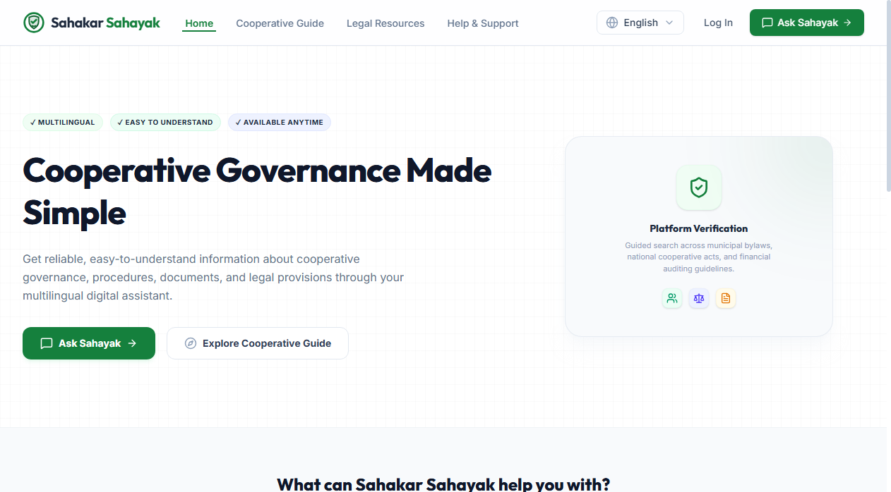
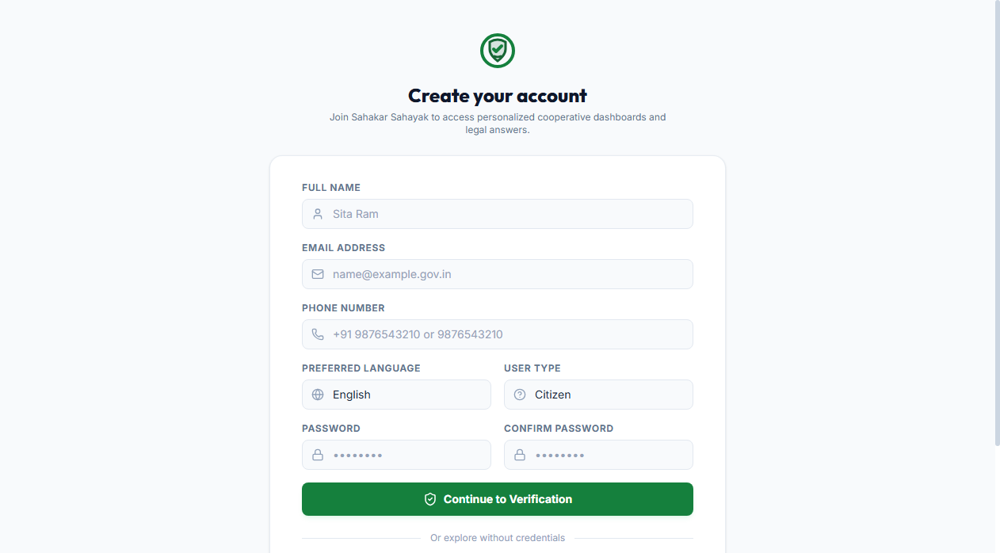
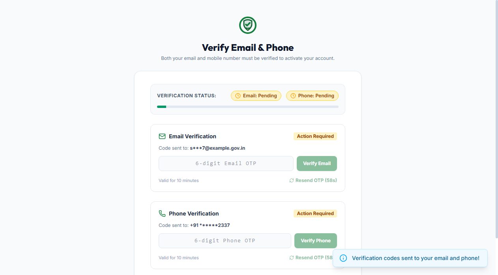
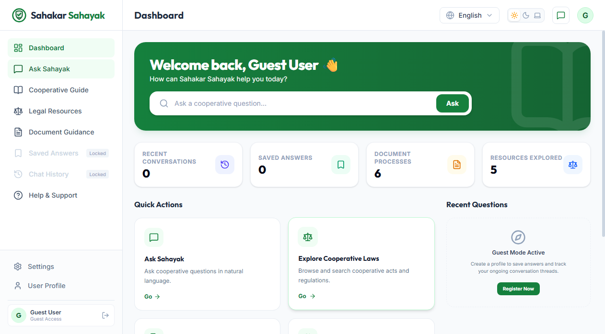
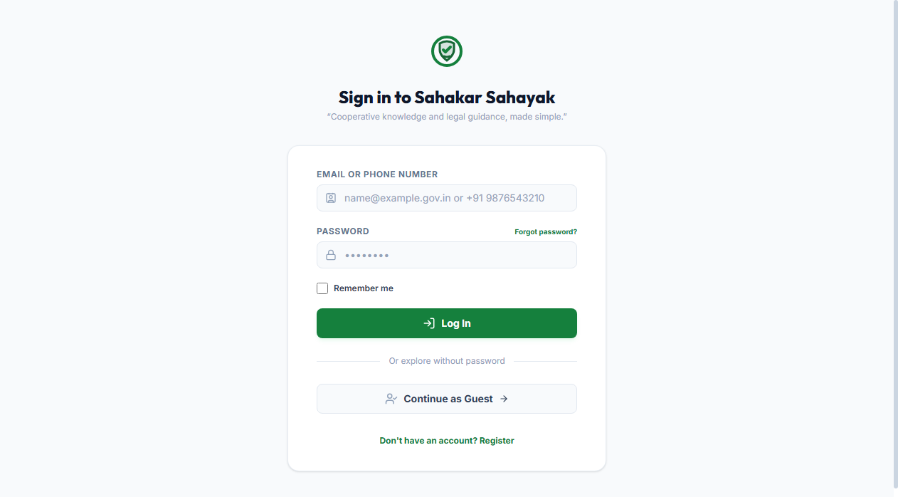
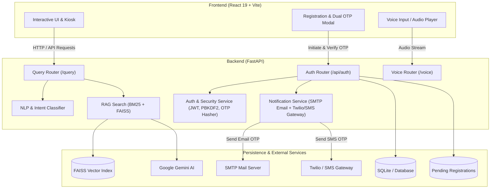

# Sahakar Sahayak (सहकार सहायक) 🇮🇳
### Multilingual Digital Assistant & Intelligence Platform for Indian Cooperative Societies

[](https://fastapi.tiangolo.com)
[](https://react.dev)
[](https://www.sqlalchemy.org/)
[](https://python.org)
[](LICENSE)

**Sahakar Sahayak** is an intelligent, bilingual digital guide and kiosk application purpose-built for the Indian cooperative sector. Developed to align with the visionary initiatives of the **Ministry of Cooperation, Government of India**, it empowers citizens, members, and administrators of **Primary Agricultural Credit Societies (PACS)**, state federations, and multi-state cooperative societies with instant legal, procedural, and governance guidance.

---

## 🌟 Key Platform Capabilities

### 1. 🔐 Complete Dual-Factor OTP Verification & Authentication
- **Two-Step Registration Flow**:
  - Requires Full Name, Email Address, Indian Mobile Number (`+91` or 10-digit format), Password, User Type, and Preferred Language.
  - Generates distinct, cryptographically secure 6-digit numeric OTPs for **Email** and **Phone**.
  - **Zero Account Creation Before Verification**: In strict accordance with security best practices, user accounts are stored in an isolated `pending_registrations` table and **never** activated or written to the permanent `users` table until **both** Email and Phone OTPs have been verified.
  - **Cryptographic OTP Hashing**: OTPs are hashed using salted PBKDF2-HMAC-SHA256. Raw OTPs are never stored in the database and never exposed in API responses.
  - **Rate Limiting & Abuse Protection**: 5 maximum verification attempts per channel, 10-minute expiry, and a 60-second cooldown rate limit on resends.
- **Dual-Identifier Login**:
  - Users can authenticate using **either** their registered **Email** OR their registered **Phone Number** (`+91 9876543210` or `9876543210`) with their password.
  - Only active, dual-verified accounts are permitted to authenticate.
  - Clear, distinct error messaging for unregistered credentials (HTTP 404), wrong passwords (HTTP 401), or unverified accounts (HTTP 403).

### 2. 🤖 Multilingual AI Cooperative Assistant (RAG & NLP)
- Hybrid Retrieval-Augmented Generation (RAG) using BM25 and FAISS vector similarity over Indian cooperative statutes, bylaws, circulars, and official guidance.
- Intent classification and language validation for English (`en`), Hindi (`hi`), Kannada (`kn`), and Nepali (`ne`).
- Source transparency: Every answer provides verifiable citations to relevant sections and clauses.

### 3. 🎙️ Regional Voice & Speech Engine
- Real-time speech-to-text transcription and text-to-speech voice synthesis.
- Built for digital kiosk deployments in rural and semi-urban cooperative banks and society offices.

### 4. 📚 Cooperative Governance & Document Guide
- Step-by-step documentation checklists for society registration, board elections, audit compliance, and dispute resolution.
- Interactive bookmarking and exportable guidance summaries.

### 5. ♿ Accessibility & Modern UI
- Responsive design tailored for desktops, kiosks, and mobile screens.
- Dark mode, light mode, high-contrast mode, and enlarged text options.

---

## 📸 Platform Interface & Verification Flow

| 1. Landing Page | 2. Registration Form (Step 1) |
| :---: | :---: |
|  |  |

| 3. Dual OTP Verification (Step 2) | 4. Dual Login (Email or Phone) |
| :---: | :---: |
|  |  |

| 5. Interactive Dashboard | 6. Document Guidance & Checklists |
| :---: | :---: |
|  |  |

---

## 🏛️ System Architecture




---

## 📡 API Reference

### Authentication & OTP Verification Endpoints (`/api/auth`)

| Method | Endpoint | Description | Auth Required |
| :--- | :--- | :--- | :--- |
| `POST` | `/api/auth/register/initiate` | Step 1: Validate details, generate separate Email & Phone OTPs, send notifications | No |
| `POST` | `/api/auth/register/verify-email` | Step 2a: Verify Email OTP; activates account if phone also verified | No |
| `POST` | `/api/auth/register/verify-phone` | Step 2b: Verify Phone OTP; activates account if email also verified | No |
| `POST` | `/api/auth/register/resend-otp` | Resend fresh OTP for email, phone, or both (60s cooldown) | No |
| `GET` | `/api/auth/register/status/{id}` | Inspect verification progress and remaining attempts | No |
| `POST` | `/api/auth/login` | Dual login using Email OR Phone Number + Password | No |
| `GET` | `/api/auth/me` | Fetch authenticated user profile details | Yes (Bearer JWT) |
| `PUT` | `/api/auth/profile` | Update profile information with uniqueness checks | Yes (Bearer JWT) |

### Intelligence & Voice Endpoints

| Method | Endpoint | Description | Auth Required |
| :--- | :--- | :--- | :--- |
| `POST` | `/query` | Process cooperative query via NLP & RAG retrieval | No |
| `POST` | `/voice/transcribe` | Transcribe voice recording into text | No |
| `POST` | `/voice/speak` | Synthesize regional text into spoken audio | No |
| `GET` | `/health` | Service health status check | No |

---

## ⚙️ Environment Configuration

Create a `.env` file in the project root based on [`.env.example`](file:///.env.example):

```env
# Database & Security
DATABASE_URL=sqlite:///backend/data/sahakar_sahayak.db
JWT_SECRET=your-secure-jwt-secret-key

# Email Notification Service (SMTP)
# If left blank, the system automatically logs OTPs to the console in development
SMTP_HOST=smtp.gmail.com
SMTP_PORT=587
SMTP_USER=your-email@gmail.com
SMTP_PASSWORD=your-app-password
SMTP_FROM_EMAIL=noreply@sahakarsahayak.gov.in
SMTP_USE_TLS=true

# SMS Notification Service
# Option A: Twilio
TWILIO_ACCOUNT_SID=
TWILIO_AUTH_TOKEN=
TWILIO_FROM_NUMBER=

# Option B: Generic SMS Gateway
SMS_GATEWAY_URL=
SMS_API_KEY=

# AI & Voice Services (Optional)
GEMINI_API_KEY=
SARVAM_API_KEY=
TELEGRAM_BOT_TOKEN=
```

> [!NOTE]
> When SMTP or SMS credentials are not configured (such as during local development or testing), the system gracefully simulates delivery and prints formatted verification alerts directly to the backend console.

---

## 🚀 Local Development Setup

### 1. Prerequisites
- **Python 3.10+**
- **Node.js 18+** and **npm**

### 2. Backend Setup
```bash
# Navigate to project root
cd "d:/SIH HACKATHON/Sahakar-Sahayak"

# Install Python dependencies
pip install -r requirements.txt

# Start the FastAPI backend server
python -m uvicorn backend.main:app --host 127.0.0.1 --port 8000 --reload
```
The backend will be available at `http://127.0.0.1:8000`. Interactive Swagger API documentation is available at `http://127.0.0.1:8000/docs`.

### 3. Frontend Setup
```bash
# In a separate terminal, install npm dependencies
npm install

# Start the Vite development server
npm run dev
```
The React frontend will be accessible at `http://localhost:5173`. Requests to `/api/*` are automatically proxied to port 8000.

---

## 🧪 Automated Testing

A comprehensive automated test suite validates the entire authentication, dual OTP verification, rate limiting, and security mechanisms:

```bash
python backend/test_auth.py
```

### Verified Test Scenarios (16/16 Passed):
1. ✅ **Registration Initiation & Security**: Validates initiation, ensures OTPs are omitted from API responses.
2. ✅ **Duplicate Email Rejection**: Rejects already-registered emails with HTTP 409 Conflict.
3. ✅ **Duplicate Phone Rejection**: Rejects already-registered Indian phone numbers (`+91` and 10-digit formats) with HTTP 409.
4. ✅ **Email OTP Verification**: Successfully verifies email factor while keeping phone pending.
5. ✅ **Phone OTP Verification & Activation**: Verifies second factor, transfers account to permanent table, and issues JWT token.
6. ✅ **Strict Pre-Verification Isolation**: Confirms user does NOT exist in permanent table and CANNOT log in until both factors are verified.
7. ✅ **Incorrect OTP Handling**: Rejects invalid OTP and decrements remaining attempt counter.
8. ✅ **Attempt Limit Exhaustion**: Rejects further OTP attempts after 5 failures with HTTP 429 Too Many Requests.
9. ✅ **Expired OTP Handling**: Rejects verification when OTP validity has expired.
10. ✅ **Resend OTP & Cooldown**: Enforces 60-second rate-limiting cooldown between resend requests.
11. ✅ **Dual Login (Email & Phone)**: Successfully authenticates using either Email or Phone Number with password.
12. ✅ **Incorrect Password Rejection**: Rejects invalid credentials with HTTP 401 Unauthorized.
13. ✅ **Unregistered Credentials**: Rejects non-existent accounts with HTTP 404 Not Found.
14. ✅ **Authenticated Endpoints**: Validates `/api/auth/me` and `/api/auth/profile` with Bearer tokens.
15. ✅ **Alternative Verification Order**: Verifies phone OTP first and email OTP second seamlessly.
16. ✅ **Inactive Account Protection**: Rejects login attempts for deactivated accounts.

To validate the frontend build:
```bash
npm run build
```

---

## 👥 Contributors & Acknowledgements

Developed as part of the **Smart India Hackathon (SIH)** initiative under the theme of **Cooperative Intelligence & Digital Governance**. Dedicated to modernizing India's cooperative grassroots movement.
