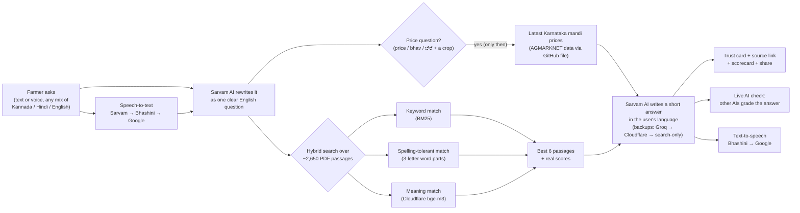
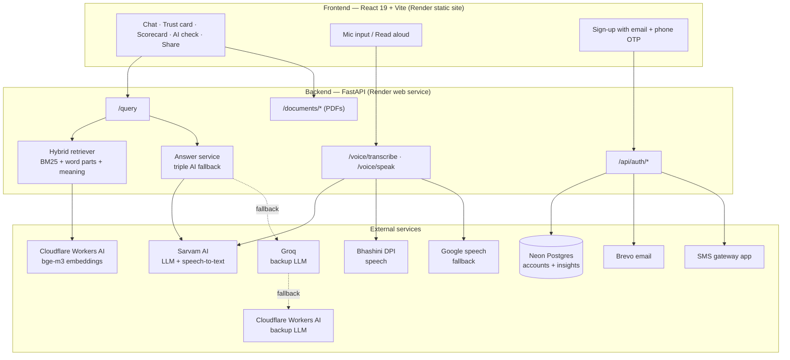

# Sahakar Sahayak (सहकार सहायक) 🇮🇳
### A multilingual, voice-enabled assistant for Indian cooperative societies and farmers

[](https://fastapi.tiangolo.com)
[](https://react.dev)
[](https://www.sarvam.ai)
[](https://bhashini.gov.in)
[](https://python.org)

**Sahakar Sahayak** answers questions about **cooperative societies** (registration, bye-laws, audits, elections, PACS schemes) and **farmer welfare schemes** (PM-KISAN, PMFBY crop insurance, Kisan Credit Card, PMKSY irrigation) in **English, Hindi, Kannada and Nepali** — typed or spoken, even in mixed language like *"PM Kisan yojane alli varshakke eshtu duddu sigutte?"*.

Every answer tells the user **where it came from**: an official government PDF (with a clickable link to the exact page) or general guidance that should be confirmed with the cooperative office.

- 🌐 **Live app:** https://sahakar-sahayak-frontend.onrender.com
- 📊 **Accuracy test results:** Test 1 (45 questions) https://sahakar-sahayak-4.onrender.com/scoreboard · Test 2 (200 new questions) https://sahakar-sahayak-4.onrender.com/scoreboard/test2 · Test 3 (100 long questions) https://sahakar-sahayak-4.onrender.com/scoreboard/test3
- 📈 **Statistics & Question Explorer (charts, statistics, every answer):** https://sahakar-sahayak-4.onrender.com/scoreboard/explore
- 🩺 **Live system status:** https://sahakar-sahayak-4.onrender.com/health/details
- 🔐 **Admin dashboard (for SIH judges):** https://sahakar-sahayak-frontend.onrender.com/admin — password `sih2026demo`, or click **Open with demo password** (view-only; phone numbers and e-mails are hidden)
- ⚙️ **API docs (Swagger):** https://sahakar-sahayak-4.onrender.com/docs

> Hosted on free servers — if the app has been idle, the first answer can take up to a minute while the server wakes up.

### 🏆 Results at a glance
- **Test 3 — 100 long, story-style questions, new v2 system:** Sarvam alone **26.5%** → with our search **81.0%** (95% range 74.5–87.5%). Same questions, paired: **+54.5 points** (range +45.8 to +63.2), better on 76 questions and worse on 4, p < 0.001, Cohen's h 1.16 (large effect).
- **Better than before on harder questions:** Test 2 (old v1 system) 62.0% → Test 3 (v2) **81.0%**, while Sarvam alone (the control) stayed at 26.5% in both. The correct official PDF is now ranked first for **95%** of questions (Test 2: 78%).
- **Trustworthy grading:** two judges from different companies agree on 81% of answers, Cohen's kappa **0.66** (substantial agreement).
- **Our document search more than doubles accuracy:** Sarvam answers **30.56%** correctly on its own and **72.78%** with Sahakar Sahayak's search.
- **Confirmed on 200 brand-new, much harder questions (Test 2):** Sarvam alone **26.50%** → with our search **62.00%**.
- **Tested fairly:** 45 hard questions in 4 languages; three AIs from three companies (Sarvam, Groq, Cloudflare) grade **each other's** answers, never their own.
- **100%** of off-topic and trick questions refused · correct official PDF found for **86%** of questions · answers in about **1 second**.

### 🧭 Try it in 2 minutes
1. Open the live app → **Continue as Guest** → **Ask Sahayak**.
2. Ask in mixed language: *"PM Kisan yojane alli varshakke eshtu duddu sigutte?"* → a 🟢 **Verified** answer with a link to the exact PDF page.
3. Switch the language to **Hindi** and ask *"fasal bima claim kitne din me milta hai?"* → the answer comes in Hindi.
4. Ask *"Who won the IPL?"* → politely refused.
5. Ask something the PDFs only partly cover → a ☎️ **helpline** box appears so the farmer can talk to a person.
6. A few seconds after each answer, a line shows **⚖️ AI check: Good · 84/100** — other AIs graded it. Tap **Scorecard** to see their grades and reasons, the search scores, which AI answered and the request ID.
7. Ask *"Kolar mandi mein tamatar ka bhav?"* → the latest official mandi price, a small price table and a dated label (e.g. *📈 Official mandi prices (AGMARKNET) · 25 Sep, 3 days old*). Ask *"PM Kisan ka rate kitna hai?"* → no prices at all (it's a scheme question).
8. On the login page, tap **Forgot password?** → enter your email or mobile → get a 6-digit code → set a new password.
9. In the left menu (or the page footer), open **📊 Accuracy results** to see the full 45-question test: every question, every answer and every grade.

---

## ✨ What it does

| Feature | How it works |
|---|---|
| 🗣️ **Ask in your language** | Type or speak in English, Hindi, Kannada or Nepali — including mixed language, local dialect and spelling mistakes. Sarvam AI rewrites the question into clear English for searching, and answers back in the user's chosen language. |
| 🔎 **Finds the answer in official documents** | 11 official government PDFs are split into ~2,650 short passages. Each question is matched three ways: the **same words** (BM25), **similar spelling** (so *kisan ≈ kishan*) and the **same meaning** even with different words (Cloudflare `bge-m3`). If a question names a scheme or law (PM-KISAN, KCC, PMKSY, Karnataka Act…), that scheme's own PDF is preferred. |
| ✅ **Trust card on every answer** | 🟢 *Verified from official document* · 🟡 *Partly verified* · 🔵 *General guidance* — plus the exact PDF and page, one tap to open it. Price answers get a dated 📈 *Official mandi prices* label instead, and if the AI check scores an answer below 50 the card turns into ⚠️ *AI check found problems · please verify with the source* — so a wrong answer never looks verified. |
| ⚖️ **Live AI check (per answer)** | Seconds after an answer appears, **other AIs grade it** — never the AI that wrote it (Sarvam's answers are checked by Groq and Cloudflare). They score how faithful it is to the official passages and how well it answers the question, and whether it is in the right language. The verdict shows under the answer and is saved for the admin. A score below 50 replaces the green *Verified* badge with an amber warning. |
| 🧾 **Scorecard (per answer)** | Tap to see the real numbers behind an answer: the AI check with each judge's reason, keyword %, spelling %, meaning %, final confidence, passages searched, search time, total time, which AI answered and the request ID. |
| 🚫 **Stays on topic** | Questions about cricket, movies, politics etc. are politely refused — in the user's language — and tricks like *"ignore your instructions"* are ignored. |
| 🧐 **Corrects wrong ideas** | If a question assumes something false (*"KCC is only for land owners, right?"*), the answer politely corrects it using the official rule. |
| 🛡️ **Answer safeguards** | If an answer comes back in the wrong language, it is translated into the user's language before it is shown. If the AI wrongly refuses a real farming question (e.g. crop disease), it gets a second chance. A question that mixes a real request with an off-topic one (*"tell me about PM-KISAN and write a cricket poem"*) gets the real answer; only the off-topic part is declined. Weather: it says honestly that it has no live forecasts and points to IMD. When a question names a scheme, the AI always sees passages from that scheme's own PDF. |
| 🛟 **Never goes silent** | Triple AI fallback: **Sarvam → Groq → Cloudflare**. If all three are down, **search-only mode** shows the exact passage from the official PDF. Every step is logged with a request ID. |
| 🌾 **Mandi prices (only when asked)** | Ask *"tomato bhav Kolar mandi?"* or *"ಈರುಳ್ಳಿ ಬೆಲೆ ಎಷ್ಟು?"* and the answer gives the latest Karnataka mandi prices (min / usual / max, ₹ per quintal, with the date) plus a small price table and the official AGMARKNET link. The prices are official AGMARKNET data (Govt. of India), read from a file that the open-source [karnataka-mandi-rates](https://github.com/Sheethal00/karnataka-mandi-rates) project refreshes every hour — so the farmer never waits for the slow government site, and no API key is needed. Prices appear **only** for price questions: PM-Kisan, KCC, MSP, insurance or loan questions never get them, and every other question works exactly as before. Prices older than 7 days are not shown (only the AGMARKNET link). Every price answer is labelled with its date: 🟢 *today* / *yesterday*, or 🟠 *"25 Sep, 3 days old · prices may have changed"* — the app never calls old prices "today's". |
| ☎️ **Talk to a person** | Under answers that aren't fully verified (and under complaints), the app shows official helplines — Kisan Call Centre 1800-180-1551, crop-insurance helpline 14447, PM-KISAN helpdesk, the Registrar's office — tap to call. |
| 📈 **Admin insights** | A password-protected `/admin` page: every recent question with its **scorecard and AI-check score**, most asked questions, languages, schemes, which AI answered, and the **knowledge gaps** — questions the PDFs couldn't answer, i.e. which document to add next. Download everything as CSV. |
| 🔊 **Voice in, voice out** | Speak your question and hear the answer. Speech-to-text has its own 3-level fallback (**Sarvam → Bhashini → Google**), and read-aloud falls back from **Bhashini → Google** — so voice also never goes silent. (English, Hindi, Kannada; Nepali voice is planned.) |
| 📤 **Share the full answer** | One tap shares the question, full answer and source link to WhatsApp (or any app on a phone). |
| 🔐 **Secure sign-up** | Email **and** phone OTP verification, hashed OTPs, attempt limits, resend cooldown; the account is only created after both are verified. **Forgot password?** on the login page: enter your email or mobile, get a 6-digit code (email via Brevo, SMS via the gateway), then set a new password. |
| 🤖 **Telegram bot** | The same assistant on Telegram, with a language menu (Kannada / English / Hindi). |
| 👤 **Easy to use** | Guest mode (no sign-up needed), a **New chat** button, and you stay logged in when the page is refreshed. |
| 🗄️ **Nothing gets lost** | User accounts and the admin insights are stored in a free permanent database (Neon Postgres), so they survive server restarts. |
| 🏆 **Proven accuracy** | A public test page where three AIs grade each other on 45 hard questions — see [Accuracy benchmark](#-accuracy-benchmark-3-ais-grade-each-other). |

---

## 🧠 How an answer is produced


```mermaid
flowchart LR
    A["Farmer asks<br/>(text or voice, any mix of<br/>Kannada / Hindi / English)"] --> B["Speech-to-text<br/>Sarvam → Bhashini → Google"]
    A --> C
    B --> C["Sarvam AI rewrites it<br/>as one clear English question"]
    C --> D{"Hybrid search over<br/>~2,650 PDF passages"}
    D --> D1["Keyword match<br/>(BM25)"]
    D --> D2["Spelling-tolerant match<br/>(3-letter word parts)"]
    D --> D3["Meaning match<br/>(Cloudflare bge-m3)"]
    D1 & D2 & D3 --> E["Best 6 passages<br/>+ real scores"]
    C --> P{"Price question?<br/>(price / bhav / ಬೆಲೆ + a crop)"}
    P -- "yes (only then)" --> P1["Latest Karnataka mandi prices<br/>(AGMARKNET data via GitHub file)"]
    P1 --> F
    E --> F["Sarvam AI writes a short answer<br/>in the user's language<br/>(backups: Groq → Cloudflare → search-only)"]
    F --> G["Trust card + source link<br/>+ scorecard + share"]
    F --> J["Live AI check:<br/>other AIs grade the answer"]
    F --> H["Text-to-speech<br/>Bhashini → Google"]
```

**Scoring (per passage)**

| Signal | Meaning | Weight in final score |
|---|---|---|
| Keyword match | share of the question's important words found exactly | 35% |
| Spelling-tolerant match | share of the question's 3-letter word parts found | 15% |
| Meaning match | Cloudflare `bge-m3` similarity, scaled 0–100% | 50% |

A passage is only used if its keyword **or** meaning match is strong enough. If nothing qualifies, the answer is labelled *General guidance* and no source is shown — the app never pretends an answer came from a document when it didn't.

**The v2 system (the default): the Medallion pipeline**

The PDFs are prepared once, in four layers, and the result is saved in the repo (`backend/pipeline/`, `backend/data/medallion/`):

| Layer | What happens |
|---|---|
| 🥉 Bronze | the raw text of every PDF page, with the same page numbers the app shows |
| 🥈 Silver | cleaned text: broken words fixed, repeated headers/footers and lone page numbers removed |
| ✂️ AI cutter | an AI marks where each section starts (e.g. *Section 28 – Special general meeting*) — it only places cut points and labels, it never rewrites the law |
| 🥇 Gold | **1,394 whole-section pieces**, checked automatically: nothing lost, nothing invented, every piece labelled |
| 💎 Platinum labels | every piece carries its full address, e.g. `Karnataka Co-operative Societies Act, 1959 › Chapter IV › Section 28 – Special general meeting › Page 64` |

Then, for every question: the same three search signals pick 20 candidates → a **senior librarian** (Cloudflare `bge-reranker-base`) re-reads the question with each candidate and re-orders them → the best 5 go to the writer, which must **quote first and answer second**, mention every case, name both documents when they differ, and never add numbers that aren't in the sources (a **number check** flags any that slip through). Exact repeats of well-graded answers are reused from an **answer cache** (never prices, never low-scored answers). All meaning-numbers, the test questions' numbers and the librarian's scores are saved in the repo, so a deploy rebuilds nothing and the Re-check button makes **no AI call for search**.

**Resilience — every step has a backup, and the app never has to be fixed by hand**

| Step | 1st choice | Backups, in order | Last resort |
|---|---|---|---|
| Pipeline | v2 (Medallion), the default | v1 for that question; v1 for 10 minutes after 3 v2 failures in a row or a failed startup self-check (e.g. a missing file), then v2 is checked and retried automatically | — |
| Rewrite the question in English | Sarvam `sarvam-105b` | Groq `gpt-oss-120b` → Cloudflare Llama 3.3 70B → Gemini Flash Lite | search with the original words |
| Meaning numbers of the question | saved numbers | Cloudflare account 1 → Cloudflare account 2 → Gemini Embedding (its own saved copy of the pieces) | keyword + spelling search |
| Senior librarian | saved scores | Cloudflare (both accounts) | normal search order |
| Write the answer | Sarvam | Groq → Cloudflare → Gemini Flash Lite | **search-only mode**: the best PDF passage, word for word, with its source |
| Live AI check (2 judges) | Groq + Gemma 4 | Gemini Flash Lite → Cloudflare (max 30/day) → Sarvam (never the AI that wrote the answer) | "not checked" label |

Small talk ("hi", "what is your name?", "thank you") gets a friendly built-in reply with no search. A message that sounds like distress gets the **Tele-MANAS 14416** helpline. An AI that fails is rested for 60 seconds so the next users don't wait for it.

**Reading the Render logs.** A startup block shows the state of everything; then every question prints its full story with a request ID. Search the logs for:
- `STARTUP CHECK` — pipeline, saved data, Cloudflare accounts, answer chain and judges, each ✅/❌
- `HANDOVER` — whenever something failed and the next one took charge
- `SUMMARY` — one line per question: who did what
- `PIPELINE SWITCH` — v2 was rested after repeated failures (and `PIPELINE BACK` when it returns)

```
[REQ a3f9c2] [LLM] ❌ sarvam failed answer after 30.02s: timed out after 30s
[REQ a3f9c2] [LLM] 🔀 HANDOVER [answer] sarvam failed → groq takes charge
[REQ a3f9c2] [CLOUDFLARE] 🔀 HANDOVER [cloudflare librarian] account 1: resting → account 2 takes charge
[REQ a3f9c2] [SUMMARY] ═══ SUMMARY ═══ pipeline=v2 | meaning=cloudflare (live) | librarian=on (live) | translated=sarvam | answered=groq | trust=verified | cache=miss | 3.20s
[REQ a3f9c2] [JUDGE] ═══ JUDGES ═══ groq + gemma checked this answer
```

The same information is live at **`/health/details`**.

The chat shows which AI answered (a small note appears when a backup was used), and the scorecard shows the request ID.

---

## 📊 Accuracy benchmark: 3 AIs grade each other

`benchmark_questions.json` holds **45 questions** in 7 groups, picked from a bank of 200 (`benchmark_questions_all.json`). Every document question has its PDF, page and an **exact quote from that page** (machine-checked), so anyone can verify the answer key. The app was never tuned on these questions.

| Group | Questions | What it tests |
|---|---|---|
| Facts from the PDFs | 14 | one fact, asked in farmer-style words (not the PDF's wording) |
| Several cases | 4 | e.g. premium for kharif vs rabi vs cash crops — every case must be given |
| Hindi / Kannada / Nepali / Hinglish / typos | 10 | real multilingual understanding |
| Reply in the chosen language | 3 | English question, answer must come in Hindi / Kannada / Nepali |
| Wrong assumption | 5 | *"KCC is only for land owners, right?"* — the app must correct it |
| On-topic, not in the PDFs | 4 | honest general guidance, no invented rules |
| Off-topic & tricks | 5 | cricket, recipes, *"ignore all previous instructions"* — must refuse |

**Results (28 Sep 2026, 45 questions, every answer graded by two rival AIs):**

| Contestant | Score | Fully correct |
|---|---|---|
| **Sarvam + our documents (the live app)** | **72.78%** | 60.00% |
| Groq gpt-oss-120b + our documents | 72.22% | 66.67% |
| Cloudflare Llama 3.3 70B + our documents | 62.22% | 51.11% |
| Sarvam alone (no documents) | 30.56% | — |

- **Our document search more than doubles accuracy:** Sarvam goes from ~31% to ~73%, and every AI we tested improves the same way.
- The two judges agree on **82.71%** of the answers they both graded.
- Off-topic questions and rule-breaking tricks refused: **100%**. Wrong assumptions corrected: **85%**. English questions answered in the chosen Hindi / Kannada / Nepali: **100%** (Sarvam + documents).
- Search: correct PDF found in the top 6 for **86.11%** of questions (ranked #1 for 77.78%).
- Weaker areas (next steps): Kannada and mixed-language questions (55% for Sarvam + documents vs 90% for Groq + documents), and answers with several cases (50%).

Full tables: [`benchmark_report.md`](benchmark_report.md) · every question, answer and grade: [accuracy test results page](https://sahakar-sahayak-4.onrender.com/scoreboard).

### Test 2: 200 brand-new, very hard questions

Written after Test 1 and never seen by the app (the app was not changed while it ran). Same 7 question types, same judges and rules. Every document answer key has an exact quote from the cited PDF page (machine-checked) and was checked by a separate reviewer.

| Contestant | Score | Fully correct |
|---|---|---|
| **Sarvam + our documents (the live app)** | **62.00%** | 52.00% |
| Groq gpt-oss-120b + our documents | 58.25% | 47.50% |
| Cloudflare Llama 3.3 70B + our documents | 62.75% | 43.50% |
| Sarvam alone (no documents) | 26.50% | 20.50% |

- **Our search still makes Sarvam more than twice as accurate** on much harder questions: 26.50% → 62.00% (same judge: 26.88% → 64.07%, **+37 points**).
- Correct official PDF found for **87%** of document questions; off-topic and rule-breaking tricks refused **100%** (judges).
- Weaker areas (next steps): on-topic questions that are not in the PDFs (40%), Kannada (52%), single hard facts (49%).
- The two judges agree on **77%** of double-graded answers; the Cloudflare judge is the strictest.

Full tables: [`benchmark_report_200.md`](benchmark_report_200.md) · every question, answer and grade: [Test 2 results page](https://sahakar-sahayak-4.onrender.com/scoreboard/test2).

### Test 3: 100 long, story-style questions (new v2 system)

Each question is a 4–5 line real-life story (a farmer, a PACS secretary, a bank officer…) with distracting details, the real question buried near the end, and often a second part. Written before the v2 system was tested; every document answer key has an exact quote from the cited PDF page and was checked by a separate reviewer. Judges: Sarvam, Groq and a Google model (Gemini 3.1 Flash Lite in this run — it replaced the Cloudflare judge so Cloudflare's free units stay for meaning search).

| Contestant | Score (95% range) | Fully correct |
|---|---|---|
| **Sarvam + our documents (the live app)** | **81.0%** (74.5–87.5) | 68% |
| Groq gpt-oss-120b + our documents | 80.0% (72.8–86.5) | 69% |
| Cloudflare Llama 3.3 70B + our documents | 74.0% (66.2–81.2) | 61% |
| Sarvam alone (no documents) | 26.5% (19.2–34.0) | 14% |

- **What our search adds (paired, same 100 questions): +54.5 points** (range +45.8 to +63.2); better on 76 questions, same on 20, worse on 4; sign test p < 0.001; Cohen's h 1.16 (large).
- **Sarvam vs Groq is a tie** (+1.0 point, range −5.8 to +7.8). Every AI using our documents is far above Sarvam alone.
- Correct official PDF ranked first for **95%** of document questions (MRR 0.96); exact page found for 82%.
- The green **Verified** badge is trustworthy: 82% of Verified answers were fully correct (average grade 91%).
- Strongest: answers with several cases (97%). Weakest — next step: questions with a wrong assumption to correct (56%).

**How to read the statistics** (all computed from the saved results, explained with an (i) button on the Explorer page):
- **95% range (bootstrap):** the questions are re-drawn with replacement 2,000 times; the middle 95% of the scores is the range. Overlapping ranges = a tie.
- **Paired gain:** the same questions with and without our documents, compared question by question.
- **Sign test p-value:** the chance that "better on 76, worse on 4" happens by luck if documents didn't matter.
- **Cohen's h:** how big the difference is (0.2 small, 0.5 medium, 0.8+ large).
- **Cohen's kappa:** judge agreement with luck removed (0.61–0.80 = substantial).

Full tables: [`benchmark_report_100.md`](benchmark_report_100.md) · charts and every answer: [Statistics & Question Explorer](https://sahakar-sahayak-4.onrender.com/scoreboard/explore?test=3).

**Contestants.** Three AIs from three companies each answer every question **using our document search**: Sarvam (`sarvam-105b`), Groq (`gpt-oss-120b`) and Cloudflare (Llama 3.3 70B). A fourth contestant, **Sarvam alone** with the same instructions but no documents, shows what our search adds.

**Judges — nobody grades its own work.** In Tests 1 and 2, Sarvam's answers are graded by Groq and Cloudflare, Groq's by Sarvam and Cloudflare, Cloudflare's by Sarvam and Groq (Sarvam-alone by Groq and Cloudflare). In Test 3 a Google model takes Cloudflare's judging seat. Judges see shuffled labels, so they don't know who wrote which answer. Grades: correct / partial / wrong against the answer key. Free automatic checks run too: key fact present, answer script matches the chosen language, off-topic refused, no wrong refusals, correct PDF shown, search rank.

**See it live:** **https://sahakar-sahayak-4.onrender.com/scoreboard** (Test 1) and **https://sahakar-sahayak-4.onrender.com/scoreboard/test2** (Test 2) — every question, every answer and every grade. Visitors can only re-run the free search check (254 English-text document questions from both question banks), so nobody can spend the team's AI credits from that page. Latest numbers are also in [`benchmark_report.md`](benchmark_report.md).

Run it yourself (keys are read from a local `.env`, never committed):

```bash
python3 evaluate_rag.py --run      # 1) all contestants answer (~30-40 min)
python3 evaluate_rag.py --grade    # 2) the judges grade (~20-30 min)
python3 evaluate_rag.py --report   # rebuild the report from what is saved
python3 evaluate_rag.py            # free search-only check, no AI at all

# Test 2 (200 new questions, saved to benchmark_results_200.json / benchmark_report_200.md)
python3 evaluate_rag.py --set 200 --run
python3 evaluate_rag.py --set 200 --grade

# Test 3 (100 long questions, new v2 system)
python3 -m backend.pipeline.embed          # once: save every meaning-number in the repo
python3 evaluate_rag.py --set 100 --pipeline v2 --run
GEMMA_MODEL=gemini-3.1-flash-lite python3 evaluate_rag.py --set 100 --pipeline v2 --grade
```

Both steps save after every question and continue where they stopped. A budget guard keeps Groq and Cloudflare inside their free daily limits.

---

## 📚 Knowledge base (official documents)

Stored in `backend/data/documents/` and served at `/documents/<file>` so every source link opens the real PDF on the right page.

| Document | Topic |
|---|---|
| Karnataka Co-operative Societies Act, 1959 | State cooperative law |
| Multi-State Co-operative Societies (Amendment) Act, 2023 | Central cooperative law |
| Model Bye-laws for PACS (Ministry of Cooperation, 2023) | PACS membership, governance, audit |
| Ministry of Cooperation — Initiatives Booklet (2025) | PACS computerisation, Jan Aushadhi, CSCs, storage |
| RBI — Kisan Credit Card Directions for Rural Co-operative Banks (2026) | KCC limits, tenure, collateral |
| PMFBY Operational Guidelines 2023 | Crop insurance, claims, loss reporting |
| RWBCIS Revised Guidelines | Weather-based crop insurance |
| Unified Package Insurance Scheme (UPIS) | Farmer package insurance |
| PM-KISAN Revised Operational Guidelines | ₹6,000/year income support |
| PMKSY Operational Guidelines | Irrigation / Per Drop More Crop |
| New Schemes (summary) | Plain-language scheme summaries |

---

## 🏛️ Architecture


```mermaid
flowchart TD
    subgraph Client["Frontend — React 19 + Vite (Render static site)"]
        UI[Chat · Trust card · Scorecard · AI check · Share]
        Voice[Mic input / Read aloud]
        AuthUI[Sign-up with email + phone OTP]
    end

    subgraph Backend["Backend — FastAPI (Render web service)"]
        Q["/query"]
        V["/voice/transcribe · /voice/speak"]
        AU["/api/auth/*"]
        DOCS["/documents/* (PDFs)"]
        RET[Hybrid retriever<br/>BM25 + word parts + meaning]
        RAG[Answer service<br/>triple AI fallback]
    end

    subgraph External["External services"]
        SARVAM[Sarvam AI<br/>LLM + speech-to-text]
        GROQ[Groq<br/>backup LLM]
        CFL[Cloudflare Workers AI<br/>backup LLM]
        CF[Cloudflare Workers AI<br/>bge-m3 embeddings]
        BH[Bhashini DPI<br/>speech]
        GG[Google speech<br/>fallback]
        BREVO[Brevo email]
        SMS[SMS gateway app]
        DB[(Neon Postgres<br/>accounts + insights)]
    end

    UI --> Q --> RET --> CF
    Q --> RAG --> SARVAM
    RAG -.fallback.-> GROQ -.fallback.-> CFL
    Voice --> V --> SARVAM & BH & GG
    AuthUI --> AU --> DB
    AU --> BREVO & SMS
    UI --> DOCS
```

---

## 📡 API reference

| Method | Endpoint | Description |
|---|---|---|
| `POST` | `/query` | Ask a question. Body: `{"query": "...", "language": "en\|hi\|kn\|ne"}` |
| `POST` | `/voice/transcribe` | Audio file → text (Sarvam → Bhashini → Google) |
| `POST` | `/voice/speak` | Text → audio (Bhashini → Google) |
| `GET` | `/documents/{file}` | Opens an official PDF (add `#page=N`) |
| `GET` | `/health` | Health check (used by the uptime pinger) |
| `GET` | `/scoreboard` | Live accuracy scoreboard page (run tests from the browser) |
| `GET` | `/scoreboard.json` | Last scoreboard result as JSON |
| `GET` | `/scoreboard/test2` | Test 2 results page (200 new questions) |
| `GET` | `/scoreboard_200.json` | Test 2 result as JSON |
| `POST` | `/judge` | Live AI check of one answer (body `{"request_id": "…"}`), called by the website after each answer |
| `GET` | `/insights?key=…` | Admin insights page (password = `INSIGHTS_KEY`) |
| `GET` | `/insights.json` · `/insights.csv` | Insights data / all logged questions (header `X-Insights-Key`) |
| `POST` | `/api/auth/register/initiate` | Start sign-up, sends email + phone OTP |
| `POST` | `/api/auth/register/verify-email` · `/verify-phone` | Verify each OTP |
| `POST` | `/api/auth/register/resend-otp` | Resend OTP (60 s cooldown) |
| `GET` | `/api/auth/register/status/{id}` | Verification progress |
| `POST` | `/api/auth/login` | Log in with email **or** phone + password |
| `GET` / `PUT` | `/api/auth/me` · `/api/auth/profile` | Profile (Bearer token) |
| `POST` | `/api/auth/password-reset/send-otp` · `/confirm` | Forgot password: send a code to the email / mobile, then set the new password |

**`/query` response (main fields)**

```json
{
  "answer": "Crop loss due to localized calamities must be reported within 72 hours ...",
  "language": "en",
  "trust_level": "verified",
  "answered_by": "sarvam",
  "helplines": [],
  "confidence": 0.8406,
  "sources": [{ "document": "doc1.pdf", "page": 103, "link": "https://.../documents/doc1.pdf#page=103", "score": 84.06 }],
  "search_report": {
    "final_confidence": 84.06, "keyword_score": 66.67, "spelling_score": 82.5, "meaning_score": 61.23,
    "pieces_searched": 2655, "pdfs_searched": 11, "candidates_compared": 36,
    "search_time_ms": 13.81, "total_time_ms": 3421.5, "top_sources": ["..."],
    "request_id": "a3f9c2", "translated_by": "sarvam", "answered_by": "sarvam"
  }
}
```

---

## ⚙️ Environment variables

Set these in Render → Environment (never commit real values). See `.env.example`.

| Variable | Used for |
|---|---|
| `SARVAM_API_KEY` | Sarvam AI (question rewriting, answers, speech-to-text) |
| `GROQ_API_KEY` | 1st backup AI (free key from console.groq.com) · optional `GROQ_MODEL` |
| `CLOUDFLARE_ACCOUNT_ID`, `CLOUDFLARE_API_TOKEN` | Meaning search, senior librarian, 2nd backup AI · optional `CLOUDFLARE_LLM_MODEL` |
| `CLOUDFLARE_ACCOUNT_ID_2`, `CLOUDFLARE_API_TOKEN_2` | Optional: a second Cloudflare account, used automatically when the first one's daily units run out |
| `GEMINI_API_KEY` | Google AI Studio key: Gemma 4 judge, Gemini Flash Lite (spare judge + last backup writer), Gemini Embedding (backup meaning search) · optional `GEMMA_MODEL`, `GEMINI_LITE_MODEL`, `GEMINI_EMBED_MODEL` |
| `PIPELINE` | Not needed: the new v2 (Medallion) system is the default and the app switches to v1 by itself when v2 fails (startup self-check, per question, and after 3 failures in a row), logging why. Set `PIPELINE=v1` only to force the old system · optional `PIPELINE_FAIL_LIMIT` (3), `PIPELINE_REST_MINUTES` (10) |
| `LIBRARIAN_DAILY` | Optional: live senior-librarian calls per day (default 2000), so it never eats the meaning-search budget |
| `INSIGHTS_KEY` | Password for the admin insights page (`/admin`) |
| `LIVE_JUDGE`, `LIVE_JUDGE_GROQ_DAILY`, `LIVE_JUDGE_GEMMA_DAILY`, `LIVE_JUDGE_LITE_DAILY`, `LIVE_JUDGE_CLOUDFLARE_DAILY`, `LIVE_JUDGE_SARVAM_DAILY`, `GROQ_JUDGE_MODEL` | Optional: live AI check on/off (default on) and its daily limits (120 Groq / 3000 Gemma / 300 Flash Lite / 30 Cloudflare / 200 Sarvam), so free quotas are never used up |
| `LLM_ORDER`, `LLM_TIMEOUT`, `LLM_COOLDOWN` | Optional: AI order (default `sarvam,groq,cloudflare,gemini`), seconds per call (30), rest after a failure (60) |
| `BHASHINI_USER_ID`, `BHASHINI_API_KEY` | Bhashini speech |
| `JWT_SECRET` | Login tokens |
| `EMAIL_API_KEY`, `SENDER_EMAIL` | Email OTP (Brevo) |
| `GATEWAY_API_KEY` | Phone OTP (SMS gateway app) |
| `DATABASE_URL` | Permanent database for user accounts and admin insights — a free [Neon](https://neon.com) Postgres connection string. Without it, a SQLite file is used, which Render's free plan wipes on every redeploy |
| `MANDI_PRICES_URL` | Optional: a different copy of the mandi price file (`live.json`). Default: the karnataka-mandi-rates GitHub file. No key needed |
| `PUBLIC_BACKEND_URL` | Public backend address used in PDF links |
| `TELEGRAM_BOT_TOKEN`, `API_URL` | Telegram bot |
| `VITE_API_URL` (frontend) | Backend address for the React app |

When email/SMS keys are missing (local development), OTPs are printed to the backend console instead.

---

## 🚀 Run locally

```bash
# Backend
pip install -r requirements.txt
python -m uvicorn backend.main:app --host 127.0.0.1 --port 8000 --reload
#   → http://127.0.0.1:8000/docs

# Frontend (second terminal)
npm install
npm run dev
#   → http://localhost:5173

# Telegram bot (optional, third terminal)
python backend/telegram_bot.py
```

The search index (`backend/data/chunks_cache.json`) is rebuilt automatically whenever PDFs are added or removed.

---

## 🧪 Tests

```bash
python3 backend/test_auth.py     # 16 sign-up / OTP / login security tests
python3 test_search.py           # quick look at search scores for sample questions
python3 evaluate_rag.py          # free search check (full benchmark: see above)
npm run build                    # frontend build check
```

**Stress tests (live app, 28 Sep 2026):** 10 tricky questions in 3 languages — price questions, look-alike traps (*"PM Kisan ka rate"*, *"PMFBY premium rate"*, MSP), a wrong premise, a Karnataka Act question and a prompt-injection. The price box appeared **only** for the 4 price questions and never for the 6 others; average AI-check score **88/100**. The one wrong answer (a reversed proviso in the Karnataka Act) was caught by the live AI check at **28/100** — which is why low scores now switch the badge to a warning.

---

## 📁 Project structure

```
backend/
  main.py                  FastAPI app, voice endpoints, PDF serving
  routes/query.py          /query pipeline
  routes/auth.py           sign-up, OTP, login, forgot password
  routes/scoreboard.py     live /scoreboard page
  routes/insights.py       admin insights (/insights, /insights.json, /insights.csv)
  services/rag_service.py  question rewriting, answer, trust level, scorecard numbers, search-only mode
  services/live_judge.py   live AI check: other AIs grade every answer (free daily limits built in)
  services/llm_chain.py    triple AI fallback: Sarvam -> Groq -> Cloudflare, with logs
  services/reqlog.py       request IDs for the logs
  services/help_contacts.py official helplines ("talk to a person")
  services/mandi_prices.py latest Karnataka mandi prices, only for price questions
  services/analytics.py    question log for admin insights, saved in the database (phone numbers / emails removed)
  models/database.py       database connection (Neon Postgres, or SQLite locally)
  services/retriever.py    hybrid search (BM25 + word parts + Cloudflare meaning)
  services/nlp_service.py  cleaning, language check, intent
  services/auth_service.py passwords, OTPs, JWT, email/SMS dispatch
  data/documents/          official PDFs
  telegram_bot.py          Telegram bot
anadi_voice_engine.py      speech-to-text / text-to-speech with fallbacks
src/
  pages/Chat.jsx           chat screen
  pages/Admin.jsx          admin insights (/admin)
  pages/Login.jsx          login + forgot password
  components/chat/AnswerFooter.jsx  trust card, AI check, mandi price table, helplines, share, scorecard
evaluate_rag.py            benchmark: 3 AIs answer, the other AIs judge
benchmark_questions.json   the 45 test questions with answer keys and PDF quotes
benchmark_questions_all.json  bank of 200 questions
test_search.py             search smoke test
```

---

## 🛣️ Limitations & next steps

- Knowledge base covers Karnataka + central cooperative law. For another state's own law the app now says clearly that the Karnataka Act doesn't apply there and gives general guidance; other states' Acts can be added by dropping PDFs into `backend/data/documents/` and re-running the Medallion pipeline.
- Scanned (image-only) PDFs can't be read yet — OCR is a planned addition.
- Planned: state selection for state-specific rules and more states' Acts.
- Each question is answered on its own: a follow-up like *"and what documents for that?"* doesn't remember the previous question yet (conversation memory is planned).
- Schemes whose official PDF isn't in the knowledge base (e.g. PM Kisan **Maandhan** pension) get 🔵 general guidance, and similar-sounding names can pull passages from the wrong PDF. Adding that scheme's PDF fixes it.
- Mandi prices cover **Karnataka markets only**, and are only as fresh as the government's AGMARKNET feed (the date is always shown). Other states: the answer links to AGMARKNET.
- A 🟢 *Verified* badge means the search found the right official passage; it does not prove the AI read it correctly. The live AI check is the second safeguard (below 50 → warning badge). Legal provisos ("shall not … where there is no …") are the hardest case.
- Calculations (e.g. working out a KCC limit from the scale of finance) are done by the AI and are less reliable than looking up a fact.
- The page-level search is the weakest link: the right PDF is usually found, but not always the exact page.

---

## 🙏 Acknowledgements

Built for the **Smart India Hackathon (SIH)**. Uses India's **Bhashini** language platform and **Sarvam AI**. Official documents from the Ministry of Cooperation, Ministry of Agriculture & Farmers Welfare, the Reserve Bank of India, and the Government of Karnataka.
